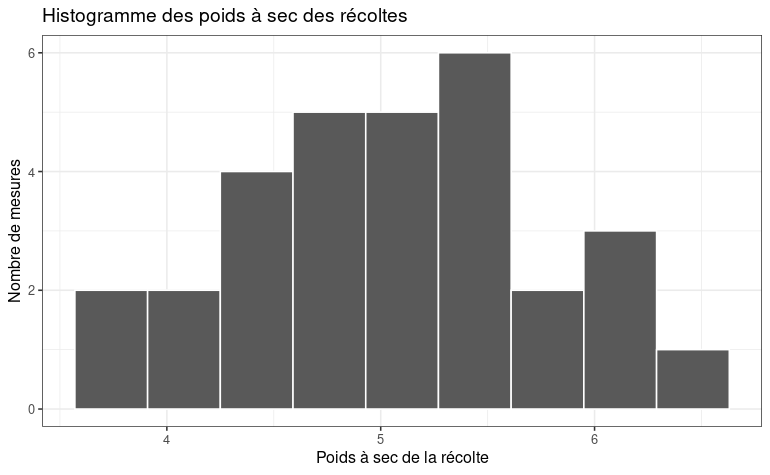

------------------------------------------------------------------------

# Data Visualization

------------------------------------------------------------------------

### Welcome to this second module of the training course "Learn R From Scratch".

In this module, we will cover:

1.  **How to load and use the ggplot2 visualization library?**

2.  **How to create and customize visualizations with ggplot2?**

3.  **How to use a visualization to illustrate a phenomenon?**

In this module, you will also learn how to use a specific data type in R: **factors**.

------------------------------------------------------------------------

## 1 - Loading and Using the ggplot2 Library

The R community has developed thousands of libraries that greatly extend the capabilities of the R language (and avoid reinventing the wheel).

One of the most widely used libraries is **ggplot2**, which is designed for data visualization. It is particularly popular in scientific publications because it is **highly customizable**.

1.  To use the library, you must first **download it from CRAN**:

```{r}
# Download the ggplot2 library
install.packages("ggplot2")
```

2.  Once installed, you need to **load it into your development environment**:

```{r}
# Load the ggplot2 library
library(ggplot2)
```

------------------------------------------------------------------------

### *Practice Exercise*

Verify that the ggplot2 package has been loaded correctly using the `search()` command.

```{r}
# Write your code here:

```

------------------------------------------------------------------------

## 2 - Creating and Customizing Visualizations with ggplot2

ggplot2 provides many standard visualizations: histograms, scatter plots, boxplots, and more. Visualizations in ggplot2 generally begin with the prefix `geom_`.

To view the complete list of visualizations available in ggplot2, you can use the `apropos()` function, which searches for a character string in the R documentation.

```{r}
# Search for all geom_ visualizations available in ggplot2
apropos("geom_")
```

You can then request additional information about a visualization using the R help system:

```{r}
# Open the help page for ggplot2 bar charts
help(geom_bar)

# Alternatively
?geom_bar
```

------------------------------------------------------------------------

### *Practice Exercise*

Find the ggplot function used to create a scatter plot (a set of points defined by their x and y coordinates). Display its help page.

```{r}
# Write your code here:

```

------------------------------------------------------------------------

### 2.1 The PlantGrowth Dataset and the Concept of Factors

We will now build our first visualizations with ggplot2.

For this purpose, we will use the `PlantGrowth` dataset. This dataset is designed to **study the effect of a treatment (not disclosed) on plant growth**. The total harvest weight is measured depending on whether Treatment 1, Treatment 2, or no treatment was applied.

```{r}
# Display the first rows of the PlantGrowth dataset
head(PlantGrowth, n = 20)
```

In R, data are **typed**. Three common types are:

1.  **Real numbers**: double or **dbl**

2.  **Character strings**: character or **chr**

3.  **Factors**: factor or **fctr**

For example, `"Four"` is considered a character string rather than a number.

In R, a **factor** is a **grouping variable**, meaning a variable that splits a dataset into several distinct groups, with each observation belonging to one specific group. Factors will be particularly useful later when we use the `group_by()` function.

For example, in the `PlantGrowth` dataset, the variable `group` is a **factor**.

```{r}
# Check whether a variable is a factor
is.factor(PlantGrowth$group)
```

It is often useful to know all possible values of a factor. In statistical terms, this corresponds to listing all the **levels** of the variable. When the variable is a factor, use the `levels()` function.

```{r}
# Display all possible values of the group variable
levels(PlantGrowth$group)
```

The `group` variable in the `PlantGrowth` dataset contains three levels:

1.  **ctrl**: the control group, **without treatment**

2.  **trt1**: the group that received **Treatment 1**

3.  **trt2**: the group that received **Treatment 2**

------------------------------------------------------------------------

### *Practice Exercise*

Using the `iris` dataset, identify which variable is a factor and list its levels.

```{r}
# Write your code here:

```

------------------------------------------------------------------------

### 2.2 First Visualization: The Histogram

We will first focus on the `weight` variable in the `PlantGrowth` dataset. A histogram allows us to see how **harvest weights are distributed**. In statistics, this is referred to as the **distribution of values** of a variable.

The ggplot2 library provides histograms through the `geom_histogram()` function. ggplot works through **layers that are progressively added using the `+` symbol**.

```{r message=FALSE}
# Histogram of the weight variable from the PlantGrowth dataset

ggplot(PlantGrowth) +
  geom_histogram(aes(weight))
```

The graph can then be customized by adding additional layers.

```{r message=FALSE}
# Customized histogram of the weight variable

ggplot(PlantGrowth) +
  geom_histogram(aes(weight),
                 color = "white",
                 bins = 9) +
  theme_bw() +
  ggtitle("Histogram of Dry Harvest Weights") +
  labs(x = "Dry Harvest Weight",
       y = "Number of Observations")
```

------------------------------------------------------------------------

### *Practice Exercise*

Using the `iris` dataset, create a histogram of the `Petal.Length` variable. Customize the theme, title, and labels as you wish.

```{r}
# Write your code here:

```

------------------------------------------------------------------------

## 3 - Using Visualization to Illustrate a Phenomenon

**Does the chart below allow us to determine whether the treatment influences plant growth?**



### 3.1 Aesthetics

To better understand this question, we will use a specific ggplot feature: **aesthetics**, controlled through the `aes()` function.

- Aesthetics can be declared globally at the beginning of the plot or within a specific layer. Be careful: a new declaration overrides the previous one.

- The aesthetic function allows you to **link graphical properties to variables in your dataset**. In other words, the graphical property varies according to the values it represents.

- **Fill color is often used to represent different groups**, or more specifically in R, **a factor**. In ggplot, the corresponding aesthetic is called `fill`.

We can therefore associate fill colors with a factor. Here we use the `group` factor corresponding to the treatment received by the plant.

```{r message=FALSE}
# Using the fill aesthetic to represent the treatment factor

ggplot(PlantGrowth) +
  geom_histogram(aes(x = weight, fill = group),
                 color = "white",
                 bins = 9) +
  theme_bw() +
  ggtitle("Histogram of Dry Harvest Weights") +
  labs(x = "Dry Harvest Weight",
       y = "Number of Observations")
```

**Question: Can you detect an effect of the treatment on plant growth?**

### 3.2 Adjusting the Graph

Depending on what you want to highlight, you may need to adjust **secondary parameters**. These parameters are described in the function documentation, although it is sometimes easier to search for examples online.

Here we will focus on the **relative position of histogram bars**. This is controlled by the `position` parameter, whose default value is `"stack"`.

```{r message=FALSE}
# Adjusting bar positions to improve readability

ggplot(PlantGrowth) +
  geom_histogram(aes(x = weight, fill = group),
                 color = "white",
                 bins = 9,
                 position = "fill") +
  theme_bw() +
  ggtitle("Histogram of Dry Harvest Weights") +
  labs(x = "Dry Harvest Weight",
       y = "Number of Observations")
```

------------------------------------------------------------------------

### *Practice Exercise*

Using the documentation and/or the internet, find the four possible values of the **position** parameter. Select the one you consider most appropriate for illustrating the effect of treatment on plant growth.

```{r}
# Modify the code below:

ggplot(PlantGrowth) +
  geom_histogram(aes(x = weight, fill = group),
                 color = "white",
                 bins = 9,
                 position = "stack") +
  theme_bw() +
  ggtitle("Histogram of Dry Harvest Weights") +
  labs(x = "Dry Harvest Weight",
       y = "Number of Observations")
```

------------------------------------------------------------------------

# 4 - Conclusion

In this module, we learned how to use the ggplot2 graphics library to create visualizations in R.

- We discovered the concept of **factors**.

- We understood the **layered programming approach** used by ggplot.

- We learned how to **customize a chart** to make it more attractive.

- We learned how to **link graphical parameters to data** in order to better illustrate a phenomenon.
